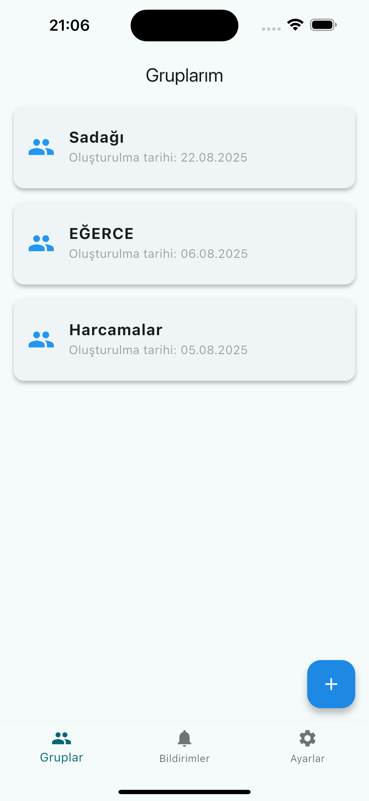
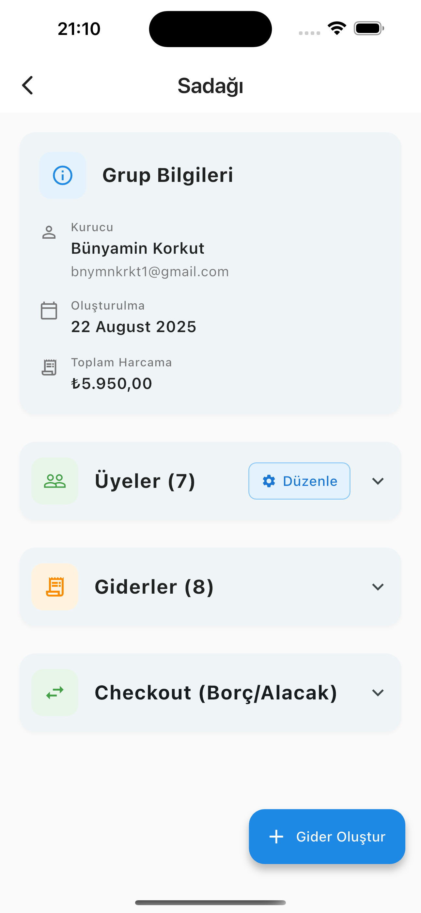
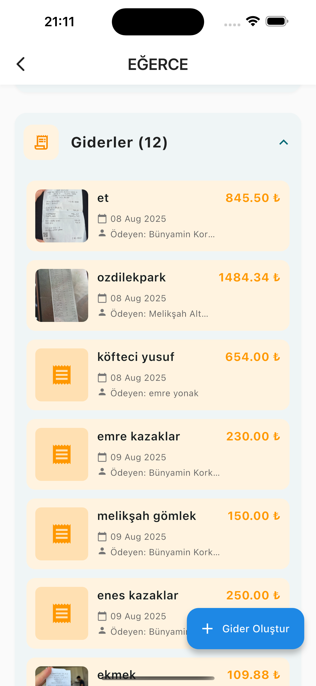
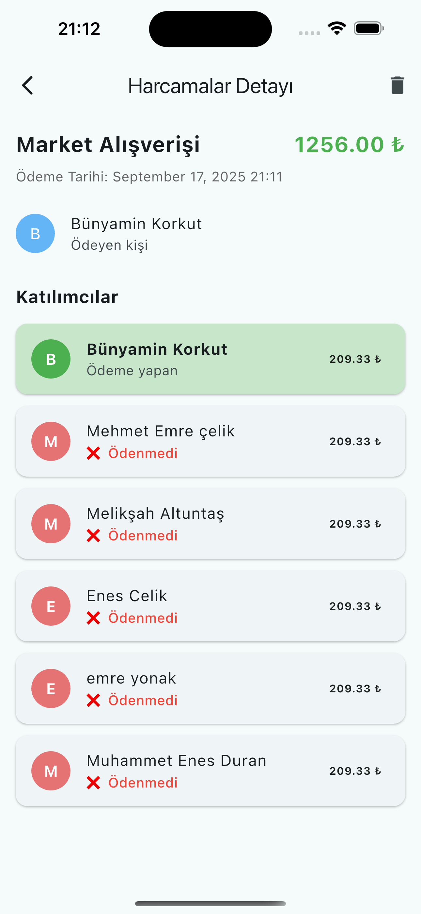

# 🧾 Kasa

**Kasa**, grup aktiviteleri sırasında yapılan harcamaları kolayca takip edip, grup üyeleri arasında adil bir şekilde bölüşmenizi sağlayan bir mobil uygulamadır.  
Tatil, etkinlik, ev arkadaşlığı veya ortak harcamalar için ideal bir çözümdür.

---

## 📱 Uygulama Ekran Görüntüleri

| Gruplarım Ekranı | Grup Detayı | Gider Listesi |
|------------------|--------------|----------------|
|  |  |  |

| Harcama Detayı |
|----------------|
|  |

> 📷 Görseller, uygulamanın Flutter tabanlı mobil arayüzünden alınmıştır.

---

## ⚙️ Özellikler

- 👥 Grup oluşturma ve üye davet etme
- 🔗 Deeplink ile kolayca link paylaşarak gruba katılma.
- 💸 Harcama ekleme ve otomatik borç/alış hesaplama  
- 📊 Her grubun toplam harcamasını ve kişi bazlı denge durumlarını görüntüleme  
- 🔔 **Firebase Cloud Messaging (FCM)** ile anlık bildirimler  
- 📢 **Google AdMob** entegrasyonu ile banner reklam gösterimi  
- 📤 Backend ile REST API üzerinden tam senkronizasyon  
- ✅ Taleplerin onaylanma/reddedilme sistemi  
- 📱 Modern ve sade arayüz (Material Design + BLoC State Management)

---

## 🧠 Kullanılan Teknolojiler

### Frontend
- **Flutter** (Dart)
- **BLoC State Management**
- **Firebase** (Notifications)
- **Google AdMob**
- **REST API entegrasyonu**

### Backend
- **Go (Golang)**  
- **MySQL**
- **Firebase
- **REST API**

> Backend kodları için ayrı bir repo bulunmaktadır:  
👉 [Kasa Backend Repository](https://github.com/bunyaminkorkut/kasa-go-server)
